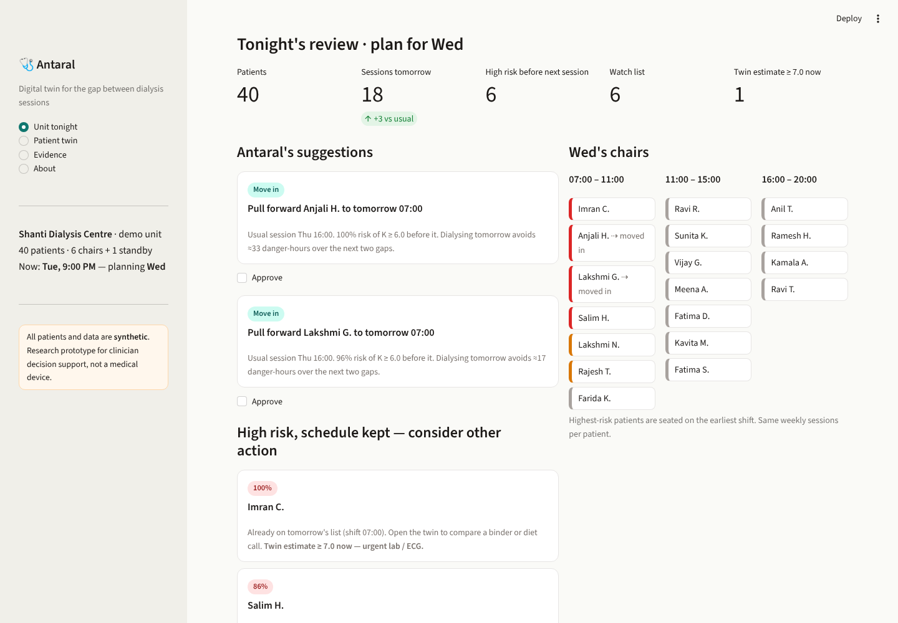
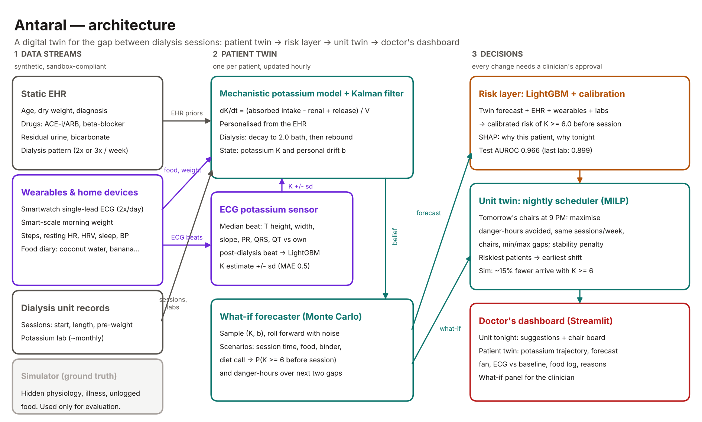
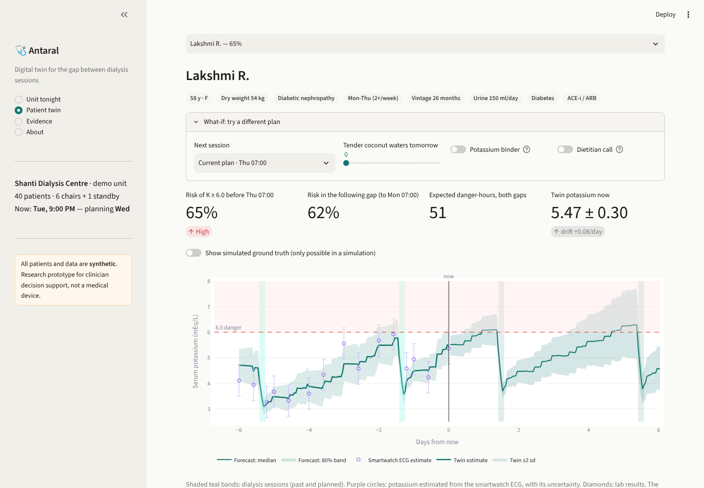
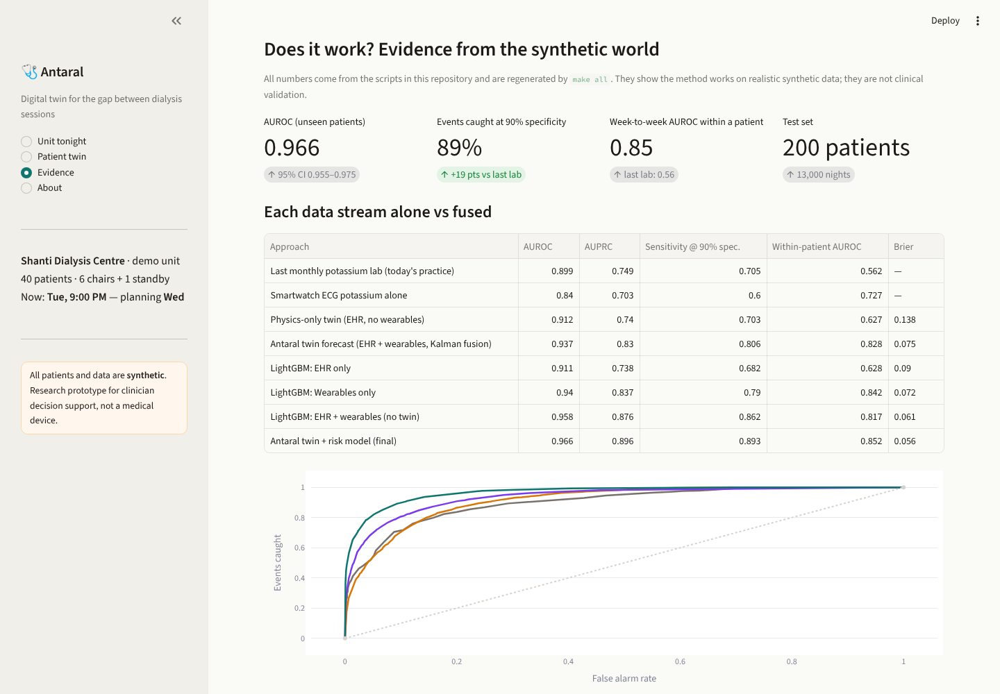

# Antaral · अंतराल
### A digital twin for the gap between dialysis sessions

> *Antaral* means "interval". For a person on haemodialysis, the interval between sessions is where the danger lives:
> potassium builds up silently, and too much of it can stop the heart without warning.

Antaral is a proof-of-concept digital twin for patients on maintenance haemodialysis in India. It predicts
**dangerous hyperkalaemia (serum potassium ≥ 6.0 mEq/L) before the next dialysis session**, by fusing the
patient's electronic health record with a smartwatch ECG and home devices. Then it goes one step further and
**uses those forecasts to re-plan the dialysis unit's chairs every evening**, so the patients heading for danger
are dialysed first. It adds no sessions and needs no new machines.



---

## Submission checklist (Digital Twin Challenge 2026)

| Required item | Where |
|---|---|
| Team details and college / incubator | [below](#team) |
| Project title | Antaral: A Digital Twin for the Gap Between Dialysis Sessions |
| Problem statement and healthcare use case | [Problem](#the-problem) |
| Technical stack, AI/ML model / framework details | [How it works](#how-it-works), [Tech stack](#tech-stack) |
| Video (≥ 20 min) | **TODO: add unlisted YouTube link** |
| Open-source license | [MIT](LICENSE) |
| Architecture diagram (PDF) | [`docs/architecture.pdf`](docs/architecture.pdf) |
| Presentation (PDF/PPT) | **TODO: `docs/presentation.pdf`** |

## Team

| | |
|---|---|
| Team name | **TODO** |
| Team leader | Nishant Majumdar, B.Tech Computer Science & Engineering (2027) |
| College | VIT Bhopal University |
| Members | **TODO** |
| Contact | **TODO** |

---

## The problem

* **Many patients in India dialyse twice a week instead of three times**, because of cost, travel and machine
  shortages. A Bengaluru single-centre study found about 30% of its haemodialysis patients on twice-weekly
  treatment, with higher weight gains and lower dialysis adequacy than thrice-weekly patients [3]. Nephrologists
  have suggested the share may be half or more of patients in some Asian countries, India included [4].
* **Between sessions, potassium accumulates.** Hyperkalaemia causes cardiac arrhythmias and sudden cardiac death,
  often with no warning symptoms.
* **Danger clusters after the long gap.** In US haemodialysis patients, deaths and cardiovascular hospitalisations
  were more frequent on the day after the long interdialytic interval than on other days [1].
* **Today, clinics are nearly blind between sessions.** Potassium is typically checked on a monthly lab, and every
  patient keeps the same fixed weekdays (for example, Mon–Thu, 7 AM) whatever their potassium is doing.

**Use case.** A dialysis unit's nephrologist or charge nurse reviews the unit every evening. Antaral shows who is
heading for dangerous potassium before their next session, why, and which schedule changes for tomorrow would
prevent the most harm with the same chairs. Every suggestion needs a clinician's approval.

## How it works



### 1. The patient twin (`antaral/twin.py`)
A per-patient **Kalman filter** around a **mechanistic potassium model**:

```
dK/dt = [ dietary K × (1 − gut excretion) − residual renal excretion + tissue release ] / V_app  + rebound
during dialysis:  K → 2.0 mEq/L bath (exponential decay), then post-dialysis rebound from cells
```

* **Personalised from the EHR**: body weight, diabetes and beta-blockers (impaired cellular uptake),
  ACE-inhibitors/ARBs (less excretion), residual urine output, bicarbonate (acidosis releases potassium).
* **Hidden state**: current potassium `K` and a **personal drift** `b`, which captures how much faster or slower
  this patient's potassium rises than the textbook model predicts (for example, food they don't log). The
  filter learns `b` over days.
* **Corrected by observations**: monthly pre-dialysis labs (precise, rare) and **smartwatch-ECG potassium
  estimates** (noisy, twice a day). Logged potassium-rich foods (tender coconut water, banana, dry fruits…)
  enter the model directly.
* **What-if forecasting**: Monte Carlo rollouts from the filter's belief under any scenario (session timing,
  extra food, a potassium binder, a dietitian call), giving `P(K ≥ 6 before the next session)` and expected
  *danger-hours* over the next two gaps.

### 2. The ECG potassium sensor (`antaral/ecg.py`, `antaral/ecg_estimator.py`)
High potassium changes the ECG: taller, narrower **peaked T waves**, a longer PR interval and a wider QRS at higher
levels. Deep learning has detected hyperkalaemia from 2-lead ECGs in large chronic kidney disease cohorts
(AUROC 0.85–0.88) [2]. Antaral measures these features from a smartwatch **median beat** and compares them with the
patient's **own post-dialysis beat**, recorded when potassium is known to be low. A LightGBM regressor turns
them into a potassium estimate with an uncertainty, which the Kalman filter uses as a weak sensor.

### 3. The risk layer (`antaral/risk_model.py`)
A LightGBM classifier with isotonic calibration. It takes the twin's forecast together with EHR, wearable, food
and lab features, and returns a calibrated probability of K ≥ 6.0 before the next session. LightGBM's native
SHAP values explain each patient's score on the dashboard.

### 4. The unit twin: a nightly scheduler (`antaral/scheduler.py`)
At 9 PM, a small integer programme (SciPy MILP) plans tomorrow's chairs:

```
maximise   Σ x_i · coef_i
subject to Σ x_i ≤ chairs,  weekly sessions per patient unchanged,
           minimum gap between sessions,  anyone at their maximum gap is scheduled
coef_i = max(benefit_i, 0) + λ   if patient i is due tomorrow
         benefit_i − λ           otherwise          (λ = 6 danger-hours: stability)
benefit_i = expected danger-hours if they wait − if dialysed tomorrow   (twin what-if, next two gaps)
danger-hours: each hour with K ≥ 6.0 counts 1, ≥ 6.5 counts 2, ≥ 7.0 counts 3
```

The two-gap horizon matters: pulling a session earlier makes the next gap longer, and the twin knows it.
The highest-risk patients are seated on the earliest shift.

### 5. The doctor's dashboard (`app/dashboard.py`)
* **Unit tonight**: suggested moves to approve, high-risk patients whose schedule can't help (with the reason),
  tomorrow's chair board, and a risk table for every patient.
* **Patient twin**: the potassium trajectory (twin estimate ± uncertainty, ECG estimates, labs, sessions), the
  forecast fan to the next two sessions, tonight's ECG beat against the patient's baseline, weight, food diary,
  "why this risk", and a **what-if panel** (move the session, extra coconut water, binder, dietitian call).
* **Evidence**: every result below, regenerated from this repository.

| Patient twin | Evidence |
|---|---|
|  |  |

---

## Results (synthetic data)

All numbers come from `make all` and are saved in [`reports/`](reports). They show that the method works on
realistic synthetic data. **They are not clinical validation.**

### Predicting K ≥ 6.0 before the next session
Trained on 400 synthetic patients and tested on **200 different patients** (13,000 patient-nights, 20.7% event rate).

| Approach | AUROC | AUPRC | Events caught at 90% specificity | Within-patient AUROC* |
|---|---|---|---|---|
| Last monthly potassium lab (today's practice) | 0.899 | 0.749 | 70% | 0.56 |
| Smartwatch ECG potassium alone | 0.840 | 0.703 | 60% | 0.73 |
| Physics-only twin (EHR, no wearables) | 0.912 | 0.740 | 70% | 0.63 |
| Antaral twin forecast (EHR + wearables, Kalman fusion) | 0.937 | 0.830 | 81% | 0.83 |
| LightGBM, EHR + wearables (no twin) | 0.958 | 0.876 | 86% | 0.82 |
| **Antaral twin + risk model (final)** | **0.966** (95% CI 0.955–0.975) | **0.896** | **89%** | **0.85** |

\*Within-patient AUROC: how well each method tells a patient's dangerous weeks from their safe weeks. The monthly
lab can't do this (0.56), because it identifies *who* runs high but not *when*. Fusing the EHR model with live
wearable data is what makes the difference (0.63 → 0.85).

What this shows honestly: a strong ML model on raw EHR + wearable features gets close to the final model (0.958).
The twin adds a little accuracy, plus something the plain classifier can't do: answer "what happens if we dialyse
her tomorrow instead of Thursday?", which the scheduler depends on.

**Smartwatch-ECG potassium sensor**, on 30 held-out calibration patients: MAE 0.50 mEq/L, correlation 0.82.
Comparing each beat with the patient's own post-dialysis beat cut the error from 0.70 to 0.62 mEq/L RMSE.

### Re-timing sessions in a 60-patient unit
Six replicate units, 8 weeks each after a 2-week warm-up. Same patients, meals and illnesses in every arm
(common random numbers), and identical session counts (1,148 per unit on average).

| | Fixed weekly pattern | Antaral, same chairs | Antaral + 1 standby machine |
|---|---|---|---|
| Patients arriving at dialysis with K ≥ 6.0 | 187 | **160 (−15%)** | 161 (−14%) |
| Episodes of K ≥ 6.0 | 199 | **177 (−11%)** | 180 (−9%) |
| Patient-hours at K ≥ 6.0 | 5,969 | 5,645 (−5%) | 5,851 (−2%) |
| Patient-hours at K ≥ 7.0 | 2,067 | 2,080 (+1%) | 2,159 (+4%) |
| Schedule changes per week | 0 | 47 | 27 |

The reduction in patients arriving with K ≥ 6.0 held in **all 6 replicate units**.

**Limitation found by the simulation:** re-timing does **not** reduce time at the most extreme levels (≥ 7.0). Those
hours come from patients whose potassium is chronically high, whose problem is dialysis *dose*, not timing. The
dashboard therefore routes them to "high risk, schedule kept: consider other action" (extra session, binder,
diet review), with the twin's what-if panel to compare options. The number of schedule changes is also higher
than a real unit would accept. Raising λ trades benefit for stability, and that trade-off should be tuned with
clinicians.

---

## Data: sandbox rules

**No real patient data is used anywhere.** Everything is generated by Antaral's own simulator:

* `antaral/cohort.py`: synthetic EHRs for Indian dialysis patients (diabetic nephropathy, CKD of unknown
  aetiology, ACE-i/ARB use, residual urine output, twice- vs thrice-weekly patterns), plus **hidden** physiology
  the twin never sees.
* `antaral/physiology.py`: hour-by-hour ground truth for potassium and fluid, with week-to-week diet drift, feast
  days, constipation, illness, unlogged food and shortened sessions.
* `antaral/ecg.py`: synthetic smartwatch median beats (a Gaussian-wave model in the spirit of ECGSYN [5]) whose
  shape responds to potassium, with patient-to-patient and day-to-day variability.

The pipeline only reads observable data (`antaral/features.py → PublicRecord`). Ground truth is used for labels and
evaluation only. **Next step for validation:** MIMIC-IV with its linked ECG module (PhysioNet credentialed access),
which contains dialysis patients with potassium labs and ECGs, then a prospective study with an Indian dialysis unit.

## Run it

```bash
pip install -r requirements.txt
streamlit run app/dashboard.py        # uses the committed demo snapshot and models
make all                              # rebuild every model, dataset and report (~15 min)
make test
```

## Repository layout

```
antaral/
  config.py          constants: thresholds, shifts, patterns, potassium-rich foods
  cohort.py          synthetic EHR + hidden physiology
  physiology.py      ground-truth simulator of a dialysis unit
  ecg.py             smartwatch median-beat synthesis and feature extraction
  ecg_estimator.py   potassium-from-ECG regressor
  twin.py            Kalman-filter patient twin + Monte Carlo what-if forecasts
  features.py        observable record and model features
  risk_model.py      LightGBM + calibration + SHAP
  scheduler.py       fixed schedule and Antaral MILP scheduler
  pipeline.py        runs a unit: simulator + twins + policy
scripts/             one script per stage (see Makefile)
app/dashboard.py     Streamlit doctor's dashboard
reports/             metrics, ablation, simulation results
docs/                architecture diagram, screenshots
tests/               physiology, ECG, twin and scheduler checks
```

## Tech stack
Python 3 · NumPy · pandas · SciPy (MILP) · scikit-learn (isotonic calibration, metrics) · LightGBM (ECG potassium
regressor, risk classifier, SHAP) · Streamlit + Plotly (dashboard) · Matplotlib (diagram) · pytest

## Responsible use
Antaral is a research prototype for **clinician decision support**. It is not a medical device, has not been
clinically validated, and must not be used to make treatment decisions. It never contacts patients or changes
schedules by itself. Any real deployment would need clinical validation, regulatory review, and data handling
compliant with India's DPDP Act.

## References
1. Foley RN, Gilbertson DT, Murray T, Collins AJ. Long interdialytic interval and mortality among patients receiving
   hemodialysis. *N Engl J Med.* 2011;365(12):1099–1107.
2. Galloway CD, Valys AV, Shreibati JB, et al. Development and validation of a deep-learning model to screen for
   hyperkalemia from the electrocardiogram. *JAMA Cardiol.* 2019;4(5):428–436.
3. Mukherjee T, et al. A comparison of practice pattern and outcome of twice-weekly and thrice-weekly hemodialysis
   patients. *Indian J Nephrol.* 2016.
4. Kalantar-Zadeh K, Casino FG. Let us give twice-weekly hemodialysis a chance: revisiting the taboo.
   *Nephrol Dial Transplant.* 2014.
5. McSharry PE, Clifford GD, Tarassenko L, Smith LA. A dynamical model for generating synthetic electrocardiogram
   signals. *IEEE Trans Biomed Eng.* 2003;50(3):289–294.

## License
[MIT](LICENSE) © 2026 Nishant Majumdar
